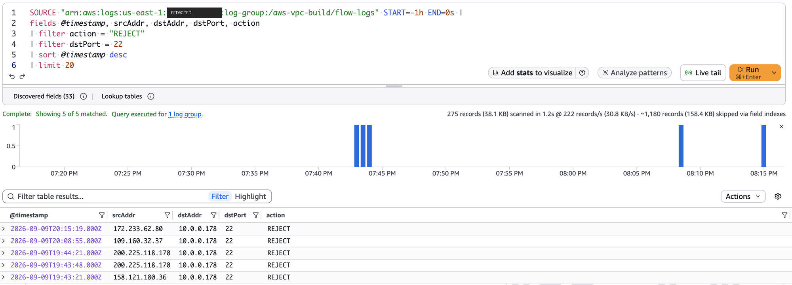

# Build Log

## Architecture decisions

| # | Decision | Rationale | Alternative considered |
|---|---|---|---|
| 1 | Multi-AZ from the start | Production-representative; single-AZ invites "how do you handle an AZ failure" in review | Single-AZ (rejected — reads as a shortcut) |
| 2 | SSM Session Manager instead of open SSH | Zero inbound rules, current best practice | Bastion with port 22 open (rejected) |
| 3 | Console/CLI first, Terraform second | Build intuition on primitives before abstracting; yields two portfolio artifacts | Terraform from day one (rejected — skips understanding the primitives) |
| 4 | Direct IAM policy attachment, no group | Single-user project — a group would wrap one policy for one user with no payoff | IAM group (rejected for now; would revisit if multi-user) |
| 5 | Custom-scoped `iam:PassRole` policy | `AmazonEC2FullAccess` deliberately excludes `PassRole` to prevent privilege escalation; scoped the `Resource` to one role ARN instead of `*` | Broader PassRole grant (rejected — reopens the escalation risk AWS excluded by design) |
| 6 | AWS Budgets over raw CloudWatch alarm | Simpler setup, notifications go to any email (not just root's) | Manual `EstimatedCharges` CloudWatch alarm (still the "classic" answer, not what was built) |
| 7 | Static access key over `aws login` | Still the most universally documented CLI auth pattern; `aws login` (CLI v2.32+, browser-based temporary creds) flagged as a stronger option to revisit | `aws login` (deferred, not rejected) |
| 8 | AWS CLI over Console for resource creation, from Phase 2 on | Commands are exact and copy-paste-able into logs; syntax carries almost directly into Terraform in Phase 8 | Console clicking (kept for verification/screenshots, not for creating resources) |
| 9 | Avoided the VPC Console's "VPC and more" wizard | It batches VPC + subnets + IGW + route tables + NAT into one invisible step, defeating the point of seeing each primitive get created | One-click wizard (rejected — hides the learning) |
| 10 | Explicit private route table, not the VPC's implicit "main" table | Makes it obvious later exactly which subnets are private and why | Relying on the unnamed default "main" table (rejected) |
| 11 | Single NAT Gateway, not one per AZ | Halves the hourly cost during the learning phase; accepted risk: private-b's egress depends entirely on public-a's AZ staying healthy | Two NAT gateways, one per AZ (deferred — the real production answer; revisit in Phase 9 or Terraform) |
| 12 | `network-ids.env` as a running source of truth for resource IDs | Phase 2's script only echoed IDs to stdout, which don't persist across separate script runs; an env file lets each phase source the last phase's output | Manual copy-paste of IDs between phases (rejected after Phase 2 — too error-prone) |
| 13 | Security groups reference other security groups as sources, not CIDR blocks | `app-sg`'s inbound rule allows traffic from `bastion-sg` directly — stays correct even if subnets are renumbered later | CIDR-based source rules (rejected — breaks silently if IP ranges ever change) |
| 14 | `bastion-sg` has zero inbound rules | SSM Session Manager works entirely over outbound HTTPS from the instance to AWS; nothing needs to be open inbound for management access | Inbound SSH rule on the bastion (rejected — the whole point of choosing SSM was avoiding this) |
| 15 | Custom NACL built for the private subnets, not left on the default | Chosen deliberately (over documenting default-allow and moving on) for hands-on practice with explicit deny rules and the stateless ephemeral-port requirement, both common interview topics | Leaving the default (allow-all) NACL in place, relying on SGs alone (valid, common in real deployments — deferred here for the learning value) |
| 16 | Explicit `deny tcp/22` rule on the private NACL, redundant with the SGs | Defense-in-depth: even a future SG mistake that opens port 22 still can't reach the private subnets, because the NACL blocks it independently | Relying on the SGs alone to block SSH (rejected — no second layer if an SG is ever misconfigured) |
| 17 | AMI resolved dynamically via an AWS-maintained SSM public parameter, never hardcoded | AMI IDs are region-specific and go stale as AWS ships updates — a hardcoded ID silently breaks the script months later | Hardcoding a known-good AMI ID (rejected) |
| 18 | Amazon Linux 2023 as the base AMI | Ships with the SSM Agent pre-installed, which is the one thing this whole project's access model depends on | Ubuntu (rejected for this project — SSM Agent isn't preinstalled, adds an unnecessary bootstrap step) |
| 19 | Instance profile existence checked defensively before attempting to create one | Verifies Phase 0's role/instance-profile pairing rather than assuming it — this check is what surfaced the real IAM gap in entry #20 below | Assuming the instance profile exists and skipping the check (rejected — would have failed less informatively at launch time instead) |
| 20 | Two additional narrowly-scoped IAM policies added to `vpc-project-builder` mid-phase (`vpc-project-ssm-access`, `vpc-project-instance-profile-mgmt`) | Real errors surfaced real gaps in the original Phase 0 policy; each grant is scoped to exactly what failed, not broadened preemptively | Granting broad SSM/IAM access upfront "just in case" (rejected — defeats the point of doing least-privilege iteratively) |
| 21 | VPC Flow Logs enabled with a dedicated CloudWatch log group and purpose-built IAM role | Turns "the security groups should work" into a permanent, queryable record instead of an inference from a terminal timeout | Relying on the `nc` timeout alone as proof (rejected — not reproducible or shareable evidence) |
| 22 | `network-ids.env` carved out of the blanket `*.env` gitignore rule | The rule was written defensively for a case (secrets) that never applied to this specific file — it holds only AWS resource IDs, which aren't sensitive, and is more valuable tracked than excluded | Leaving it untracked (rejected — this was silently true for the whole project until caught in this phase) |

## Phase 0 — Guardrails & IAM

**Account:** Synsmyr Forgue — flagged in AWS as account alias/root; account ID
intentionally not hardcoded here (see note in Open Items).

**Region:** `us-east-1` — cheapest pricing, full feature availability, matches
the region billing/CloudWatch metrics require, negligible latency difference
from the US East Coast.

- [x] Root user: MFA enabled, no active access keys
- [x] AWS Budget: `aws-vpc-build-budget`
  - Type: Cost budget, Monthly, Recurring, fixed amount $5.00
  - Alert #1: Actual spend > 80% ($4.00) → email
  - Alert #2: Actual spend > 100% ($5.00) → email
  - (Both alerts use the "Actual" trigger; "Forecasted" was discussed as an
    earlier-warning alternative but not required at this budget size)
- [x] IAM Role: `vpc-project-ec2-ssm-role`
  - Trusted entity: AWS service → EC2 (use case: "EC2 Role for AWS Systems Manager")
  - Trust policy: allows `ec2.amazonaws.com` to `sts:AssumeRole`
  - Permissions: `AmazonSSMManagedInstanceCore` (AWS managed) — nothing broader
  - Purpose: attached to EC2 instances in Phase 5 so the SSM Agent can register
    without any inbound SSH rule
- [x] IAM User: `vpc-project-builder`
  - Console access: disabled — CLI/programmatic only
  - Permissions method: policies attached directly (not via a group)
  - Policies attached:
    - `AmazonEC2FullAccess` (AWS managed) — covers VPC/subnet/route
      table/security group actions, all of which live in the `ec2:*` namespace
    - `vpc-project-pass-ssm-role` (customer managed) — grants `iam:PassRole`
      scoped to exactly the `vpc-project-ec2-ssm-role` ARN
  - MFA: intentionally skipped — no console password exists for this user, so
    there's no sign-in surface for MFA to protect
  - Access key: created and verified working (ID intentionally not recorded
    here — see Open Items)
- [x] AWS CLI installed locally via Homebrew → `aws-cli/2.36.40`
- [x] Local named profile configured: `aws configure --profile vpc-project`
- [x] Identity verified: `aws sts get-caller-identity --profile vpc-project`
      resolves to `arn:...:user/vpc-project-builder` — confirmed 2026-09-07

## Phase 2 — VPC, subnets, IGW, route tables

- [x] VPC created: `10.0.0.0/16`; DNS hostnames explicitly enabled (off by
      default on custom VPCs — needed later for EC2 public DNS names)
- [x] Four subnets created per the CIDR plan, tagged `Project=aws-vpc-build`
- [x] Auto-assign public IP enabled on both public subnets
- [x] Internet Gateway created and attached to the VPC
- [x] Public route table: `0.0.0.0/0 → igw-...`, associated with both public subnets
- [x] Private route table: explicit, associated with both private subnets,
      **no internet route** — verified via `describe-route-tables` showing
      only the `local` (`10.0.0.0/16`) route
- Built and run via `scripts/phase2-create-network.sh` — clean run, no errors

Resource IDs created in this phase. Every command from Phase 3 onward
references these exact values.

```bash
VPC_ID=vpc-00c13439a534d15bb
PUBLIC_A=subnet-0db0f90a4c1bbbbc1
PUBLIC_B=subnet-05bdbc0c8d8ede300
PRIVATE_A=subnet-042dcdc30d65fb74e
PRIVATE_B=subnet-0136f816653eccb9b
IGW_ID=igw-09465978156fc92f0
PUBLIC_RT=rtb-02e68286cf13e3741
PRIVATE_RT=rtb-005299cd4cae1fa46
```

These are resource identifiers, not credentials — unlike the account ID and
access key ID (see Open Items), they carry no access on their own and are
safe to commit.

## Phase 3 — NAT Gateway

- [x] Elastic IP allocated
- [x] NAT Gateway created in `public-a` (single NAT — see decision #11)
- [x] Waited for `available` state via `aws ec2 wait nat-gateway-available`
      rather than manually polling the console
- [x] Private route table updated: `0.0.0.0/0 → nat-...` added alongside the
      existing `local` route
- [x] Verified with a real before/after: `describe-route-tables` run against
      the same route table both before Phase 3 (one route) and after (two
      routes)
- Built and run via `scripts/phase3-create-nat.sh` — clean run, no errors
- Cost flag: a NAT Gateway runs ≈ $0.045/hr (~$1/day, ~$32/month) — against a
  $5 budget, tear it down between sessions with `delete-nat-gateway` +
  `release-address` rather than leaving it running idle; both are cheap and
  fast to recreate

Resource IDs created in this phase. The default route from `PRIVATE_RT` to
`NAT_ID` references these values.

```bash
NAT_ID=nat-0dffb94193751001d
EIP_ALLOC_ID=eipalloc-08bc61998f700e6ac
```

## Phase 4 — Security groups & NACL

- [x] `bastion-sg` created — zero inbound rules, default allow-all egress
- [x] `app-sg` created — inbound `tcp/80` from `bastion-sg` (security-group
      source, not a CIDR block) — verified via `describe-security-groups`:
      the rule shows a `UserIdGroupPairs` entry referencing bastion-sg's
      GroupId, no `IpRanges`/`CidrIp` present anywhere near it
- [x] `private-nacl` created and associated with both `private-a` and
      `private-b`, replacing their default NACL association
  - Inbound: `90` deny tcp/22 from `0.0.0.0/0` · `100` allow all from
    `10.0.0.0/16` · `110` allow tcp/1024-65535 from `0.0.0.0/0` (ephemeral
    return traffic)
  - Outbound: `100` allow all to `10.0.0.0/16` · `110` allow tcp/80 to
    `0.0.0.0/0` · `120` allow tcp/443 to `0.0.0.0/0`
  - AWS's own implicit final rule (`32767`, deny all) confirmed visible in
    `describe-network-acls` output — the textbook "implicit deny," seen
    directly instead of just described
- Built and run via `scripts/phase4-create-security-groups.sh` and
  `scripts/phase4b-create-nacl.sh` — both clean runs, no errors, once
  actually present on disk (see troubleshooting log)

## Phase 5 — EC2 instances

- [x] Latest Amazon Linux 2023 AMI resolved: `ami-081b0a6eac00b4f53`
- [x] Instance profile `vpc-project-ec2-ssm-role` confirmed to already exist
      (auto-created by the IAM console back in Phase 0 when the role itself
      was created — see troubleshooting #20 for why this took two attempts
      to confirm)
- [x] Bastion launched in `public-a`, `bastion-sg`, instance profile attached:
      `i-09f124bc9499c5377`
- [x] App instance launched in `private-a`, `app-sg`, instance profile
      attached, user-data installs nginx with a custom identifying page:
      `i-00b9e827e0ef6bed3`
- [x] Both instances confirmed `running` via `aws ec2 wait instance-running`
- [x] Session Manager plugin installed locally (separate from the AWS CLI
      itself — required for `aws ssm start-session` to work at all)
- [ ] SSM registration verified (`PingStatus: Online` on both instances via
      `describe-instance-information`) — pending as of this log entry

Cost/account context worth recording: this account falls under AWS's
post-July-2025 credit-based Free Tier (not the older 12-month/750-hours
model) — a $100–200 promotional credit expiring 6 months from signup
(confirmed: $119.47 remaining, expires December 10, 2026). Billing shows
$0.00 month-to-date because usage is being absorbed by the credit balance;
the $5 Budget alarm from Phase 0 still tracks correctly regardless, since
AWS Budgets measures pre-credit usage cost, not the post-credit bill.

## Phase 6 — Validation

- [x] SSM session into bastion confirmed working — real interactive shell,
      zero inbound ports involved
- [x] `curl http://10.0.10.81` from inside the bastion session returned the
      app tier's nginx page — proves route tables, `app-sg`, and the NACL's
      rule 100 all cooperate correctly for VPC-internal traffic
- [x] SSM session opened directly into the app instance, independent of the
      bastion — confirms the app instance's own NAT path to the SSM service
      works on its own, not just as a hop-through
- [x] NAT translation proven, not just inferred: `curl
      https://checkip.amazonaws.com` from inside the app instance returned
      `32.197.4.224`, matched exactly against the NAT gateway's Elastic IP
      via `describe-addresses` in a separate terminal
- [x] Negative path tested from an external machine:
      `nc -zv -G 3 44.201.47.228 22` → timed out, not refused — confirms
      `bastion-sg`'s zero-inbound-rules design silently drops rather than
      actively rejecting
- [x] VPC Flow Logs created — log group `/aws-vpc-build/flow-logs`, IAM role
      `vpc-project-flow-logs-role`, flow log ID `fl-0486c284df07f0d59`
- [x] Logs Insights query (`filter action = "REJECT" | filter dstPort = 22`)
      returned 5 REJECT entries in the trailing hour — see screenshot below



Notable finding, not just a routine check: the five rejected entries came
from four distinct external source IPs in unrelated ranges — `172.233.62.80`,
`109.160.32.37`, `158.121.180.36`, and `200.225.118.170`, the last appearing
twice 33 seconds apart. Spread across unrelated ranges like that, this is
evidence of automated internet-wide port-22 scanning reaching the instance
and being silently dropped, independent of the deliberate `nc` test.
`dstAddr` on every entry shows the bastion's *private* IP (`10.0.0.178`), not
its public one — expected behavior, since Flow Logs capture traffic at the
ENI, after the Internet Gateway has already translated the destination from
public to private.

## Troubleshooting log

1. **Budget amount field rejected `$5`.** Validator wanted a bare number.
   Error: "Budgeted amount must be a number." Fix: entered `5`, no `$`.
2. **Budget name field blocked submission when empty.** Fix: named it
   `aws-vpc-build-budget`.
3. **Role vs. User terminology mix-up.** Started building an IAM *Role* (for
   EC2/SSM) under a step meant for creating an IAM *User* for CLI login. A
   role has no login and is assumed by a service; a user is a persistent
   identity for a person. Resolved by keeping the role (it's legitimate,
   early Phase 5 work) and separately creating the actual user afterward.
4. **Policy vs. Role confusion during permission selection.** A screen
   showing 52 "ec2" search results was a list of IAM *policies*, not roles,
   despite a similar-looking flow. Resolved by selecting `AmazonEC2FullAccess`.
5. **`AmazonEC2FullAccess` doesn't include `iam:PassRole`.** By design — AWS
   excludes it from EC2-managed policies to prevent privilege escalation (EC2
   access alone shouldn't let you attach *any* role to an instance). Resolved
   with a customer-managed policy scoping `PassRole` to one specific role ARN.
6. **AWS CLI not installed locally.** `aws configure --profile vpc-project` →
   `zsh: command not found: aws`. Console setup (IAM, Budgets) has no bearing
   on whether the CLI binary exists on the machine — separate concerns.
   Resolved via `brew install awscli`; verified with `aws --version`.
7. **Uncertainty over the `AWS Access Key ID [None]:` prompt.** This value is
   generated per-account, once, in the IAM console — it can't be supplied
   externally. Clarified where to retrieve it and that the secret is
   unrecoverable if not saved at creation time (requires deleting and
   regenerating the key).
8. **CloudShell vs. local terminal.** CloudShell auto-authenticates as the
   current console session and doesn't suit named multi-profile workflows or
   living next to the project's future Terraform files. Local terminal is the
   right tool for the whole project going forward.
9. **Angle brackets in an example command taken literally.** A command shown
   as `--route-table-ids <PRIVATE_RT>` was pasted into the shell exactly as
   written. In bash/zsh, `<` and `>` are real input/output redirection
   operators, not placeholder syntax — the shell tried to read from a file
   literally named `PRIVATE_RT` and failed with "no such file or directory."
   Fix: substitute the real ID directly, or use
   `$(grep KEY= network-ids.env | cut -d= -f2)` so commands stay copy-paste
   safe without manual editing.
10. **Downloaded script not found by `bash`.** `bash phase3-create-nat.sh`
    failed with "No such file or directory" immediately after downloading it.
    Cause: browser downloads land in `~/Downloads` by default, unrelated to
    the shell's current working directory. Fix:
    `mv ~/Downloads/phase3-create-nat.sh ~/Downloads/network-ids.env ./`
    from inside the repo.
11. **Pager left open after wide CLI output.** Both `less` (Phase 0) and
    `--output table` results (Phase 3) drop the terminal into a pager
    instead of returning to the prompt. Fix: `q` exits the pager without
    running or cancelling anything.
12. **Deliberate before/after verification — a habit worth keeping, not a
    bug.** Ran `describe-route-tables` against the private route table
    *before* executing `phase3-create-nat.sh` to confirm only the `local`
    route existed, then re-ran the identical command afterward to watch the
    `0.0.0.0/0 → nat-...` route actually appear. Confirms the change with a
    real diff rather than trusting a script's own "success" output.
13. **NACL script run before its prerequisite security-group script had
    actually been downloaded.** `phase4b-create-nacl.sh` completed
    successfully — the private subnets were network-ACL-protected before
    `bastion-sg`/`app-sg` existed at all. Not a functional problem (the two
    scripts are independent), but a reminder that script *order in the plan*
    and script *order of execution* aren't automatically the same thing —
    worth a beat to confirm prerequisites are actually done, not just
    assumed done.
14. **Placeholder angle brackets caused the same failure as before, this
    time in a note rather than a real command.** `<any-private-subnet-IP-
    if-you-had-one>` was pasted into the shell and hit the identical `<`/`>`
    redirection issue from Phase 3 — a repeat of a known failure mode,
    flagged here since it's worth being newly cautious around *any* text
    that looks like a placeholder before running it, not just commands
    explicitly marked as ready-to-run.
15. **A missing shell variable produced a misleading result instead of an
    error.** `describe-security-groups --group-ids $(...)` was run before
    `APP_SG` existed in `network-ids.env`; the substitution silently
    resolved to nothing, so the command ran as an unfiltered query and
    returned every security group in the account — including an unrelated,
    AWS-auto-created "default VPC" present in every region regardless of
    activity. Lesson: a missing required argument doesn't always error
    loudly; sometimes it just broadens the query into something that looks
    plausible but isn't what was asked for. Always check the `VpcId` in
    results like this against the actual project VPC ID.
16. **A presented file was never downloaded at all**, not just misplaced —
    `ls ~/Downloads/phase4-create-security-groups.sh` came back "No such
    file or directory" too, confirming the download itself never happened
    (likely only one of two files presented together got clicked). Fixed by
    re-presenting the file and downloading it directly.
17. **AWS CLI accepts protocol names but stores/displays numeric codes.**
    `--protocol tcp` in `create-network-acl-entry` shows up as `Protocol: 6`
    in `describe-network-acls` output — not an error, just AWS translating
    the friendly name to TCP's real IANA protocol number on the way in.
18. **Pager `:` prompt vs. `(END)`.** A `:` prompt at the bottom of a `less`
    view means more content exists below (page down with the space bar);
    `(END)` means there's genuinely nothing further. Easy to mistake `:` for
    a stalled or broken view rather than "there's more, keep scrolling."
19. **IAM gap: `vpc-project-builder` had no SSM permissions at all.**
    `AmazonEC2FullAccess` covers `ec2:*` but not `ssm:*` — a completely
    separate IAM namespace, even though the two services are used together
    constantly in this project. Blocked the AMI lookup (`ssm:GetParameters`)
    and would have blocked `aws ssm start-session` (`ssm:StartSession`) next.
    Fixed with a new scoped policy, `vpc-project-ssm-access`: read access to
    AWS's own public SSM parameters, plus session start/describe/terminate
    scoped to this account's EC2 instances.
20. **IAM gap: a permission-denied failure and a genuine "doesn't exist"
    looked identical to the script.** The instance-profile existence check
    (`aws iam get-instance-profile`) itself requires `iam:GetInstanceProfile`
    — a permission `vpc-project-builder` didn't have. Since the check only
    looks at exit code, an access-denied response and a real 404 both
    triggered the same "missing — creating it" branch, which then failed on
    `iam:CreateInstanceProfile`. Fixed with `vpc-project-instance-profile-mgmt`,
    scoped to the one instance-profile ARN this project needs. Once granted,
    the check succeeded and confirmed the profile had actually existed the
    whole time — the original Phase 5 design assumption (IAM console
    auto-creates a matching instance profile for EC2 roles) was correct;
    `CreateInstanceProfile`/`AddRoleToInstanceProfile` turned out unneeded in
    the end, harmless to have granted anyway.
21. **A script dying partway through left a real, billing, untracked EC2
    instance behind.** The bastion launched successfully; the app instance's
    launch then failed on a missing local file (`app-userdata.sh`), and
    because the script exited before its own "append IDs to
    `network-ids.env`" step, the bastion's ID was never recorded anywhere.
    A live preview of exactly the problem Terraform's state file exists to
    solve (Phase 8) — a plain bash script has no memory of partial success.
22. **Second occurrence of a two-file download only partially completing** —
    `app-userdata.sh` specifically, same shape as the NACL/security-groups
    gap from Phase 4.
23. **A relayed instance ID was malformed** (16 hex characters instead of
    the correct 17) and AWS correctly rejected it outright with
    `InvalidInstanceID.Malformed` rather than silently doing something
    wrong — compounded by angle-bracket placeholder syntax reused in the
    same command. Resolved by re-querying AWS directly
    (`describe-instances` filtered by tag and state) for the real ID
    instead of trusting a retyped/relayed value, run as an isolated step
    before acting on the result.
24. **General lesson reinforced twice this phase:** when a value might be
    wrong, re-derive it from the source (AWS's own API) rather than
    retrying a guess a second or third time — cheaper and more reliable
    than iterating on something already suspect.
25. **IAM gap, fourth occurrence of the same pattern:** `vpc-project-builder`
    lacked `iam:PassRole` on the newly created `vpc-project-flow-logs-role`
    — the existing PassRole policy only listed the SSM role's ARN. Fixed by
    adding a second ARN to that policy's existing `Resource` array rather
    than creating a new policy, since it's the same permission covering one
    more specific resource.
26. **IAM eventual consistency, not a wrong edit.** After the PassRole fix,
    `create-flow-logs` failed once more with the identical error. Checking
    the policy's actual JSON and its "Policy versions" tab directly (both
    confirmed the fix was correctly saved and set as default) ruled out a
    bad edit; waiting roughly a minute and retrying succeeded. A real,
    documented AWS characteristic — policy changes don't always propagate
    instantly everywhere.
27. **`nc -w 3` didn't reliably enforce a timeout on macOS.** The negative-
    path test hung well past 3 seconds. Root cause: on macOS's built-in
    (BSD) `nc`, `-w` is an idle-connection timeout, not a connect-attempt
    timeout — the OS's own TCP retry logic kept the attempt alive
    underneath it. `-G`, macOS's connect-timeout-specific flag, gave a fast,
    deterministic result instead.
28. **Flow Log `dstAddr` showed a private IP where a public one was
    targeted** — initially looked like a mismatch, actually expected
    behavior (see architecture note above on IGW translation happening
    before the ENI sees the packet).
29. **The captured REJECT traffic wasn't the deliberate test at all.** Four
    distinct source IPs across unrelated ranges is consistent with
    automated scanning, not one manual `nc` attempt repeated. Genuinely
    useful discovery rather than a troubleshooting problem — logged here
    because it changed the interpretation of the result, not because
    anything was broken.

## Naming & tagging conventions

| Resource | Name |
|---|---|
| IAM Role (EC2 → SSM) | `vpc-project-ec2-ssm-role` |
| IAM Role (VPC Flow Logs → CloudWatch) | `vpc-project-flow-logs-role` |
| IAM User (CLI identity) | `vpc-project-builder` |
| Customer-managed policy | `vpc-project-pass-ssm-role` |
| CloudWatch log group (flow logs) | `/aws-vpc-build/flow-logs` |
| AWS Budget | `aws-vpc-build-budget` |
| Local AWS CLI profile | `vpc-project` |
| Resource tag (all resources) | `Project = aws-vpc-build` |

## Open items / next steps

- Account ID and access key ID are deliberately not written into this file —
  neither should be committed to git history, even though only the *secret*
  key is truly sensitive. When Phase 8 (Terraform) needs the account ID, pull
  it via `data "aws_caller_identity"` rather than hardcoding it.
- Decide whether to migrate from a static access key to `aws login`
  (browser-based temporary credentials, CLI v2.32+) — still undecided; revisit
  before Phase 8 (Terraform).
- Decide per session: tear down the NAT Gateway + EIP, or leave running into
  the next phase — a conscious cost/convenience trade-off, not a default.
- Begin Phase 7: finalize documentation — polished network diagram,
  `docs/security-groups.md` populated with the actual SG/NACL rule tables,
  cost breakdown, and teardown instructions.
